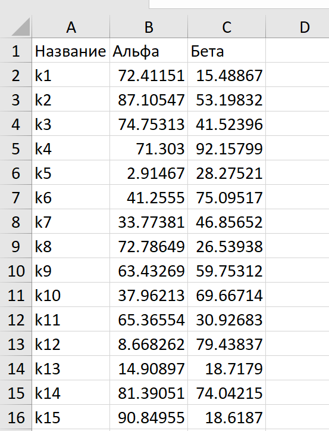
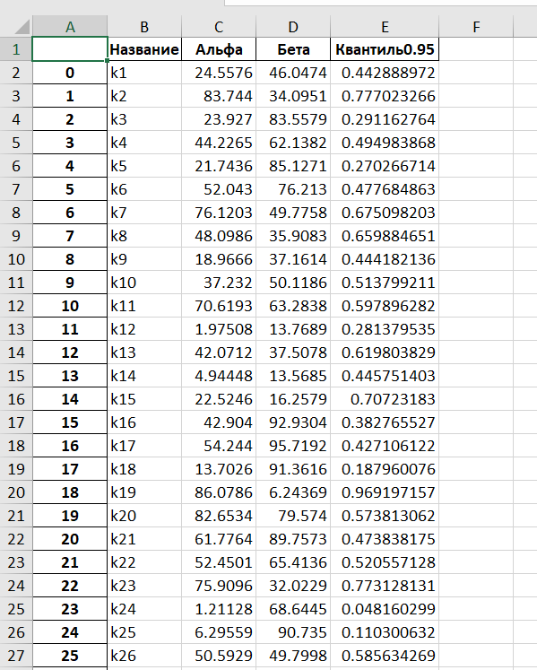

Версия python: 3.11.3

## excel_estimator.py

Программа для расчёта квантиля $q_p$ с заданным уровнем вероятности $p$ бета-распределения $B(\alpha, \beta)$. Данные берутся из заданного эксель файла. 

---

Для случайной величины с бета-распределением $X\sim B(\alpha, \beta)$ Плотность распределения:
$$ f_X(x) = \frac{1}{B(\alpha, \beta)}\cdot x^{\alpha-1}(1-x)^{\beta - 1},\; где\,B(\alpha, \beta) = \int_0^1 x^{\alpha - 1}(1-x)^{\beta-1}dx  $$
Квантиль заданной вероятности находится из:
$$ p = P[x<q_p] = \int_0^{q_p} f_X(x)dx = \frac{B_{q_p}(\alpha, \beta)}{B(\alpha, \beta)} = I_{q_p}(\alpha, \beta) \Rightarrow q_p = I^{-1}_p(\alpha, \beta) $$

Данная принимает значения $\alpha, \beta$ из файла Excel, уровня вероятности $p$ от пользователя и проводит расчёт $q_p = I_{q_p}^{-1}(\alpha, \beta).$ 

Формат данных в таблице Excel: первая строка выделяется под названия столбцов. Названия столбцов могут быть произвольными. Программа работает с первыми 3 найденными столбцами, считая, что 1 столбец $-$ пользовательское название, 2 столбец $-$ значение $\alpha$, 3 столбец $-$ значение $\beta$.

### Пример работы программы

Данные в таблице Excel записаны в следующем формате



```
$ python excel_estimator.py
Введите название (или путь) файла Excel с данными: beta.xlsx

Открываем файл beta.xlsx
Найдены следующие листы: Лист1
Выбран лист Лист1

Парсим данные
Найдены следующие столбцы: Название Альфа Бета
Первые три считаем следующими столбцами: название, значение альфа, значение бета
Введите уровень вероятности для расчёта квантиля (0.95 по умолчанию): 
Протокол сохранен в: E:\Mine data\Квантиль для бета-распределения\protocol
```

Полученный протокол

